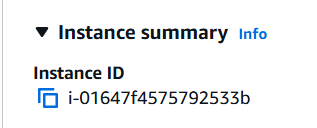
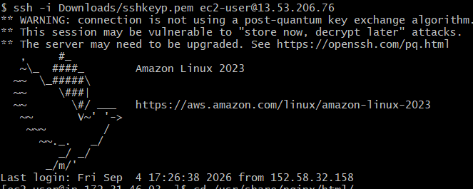
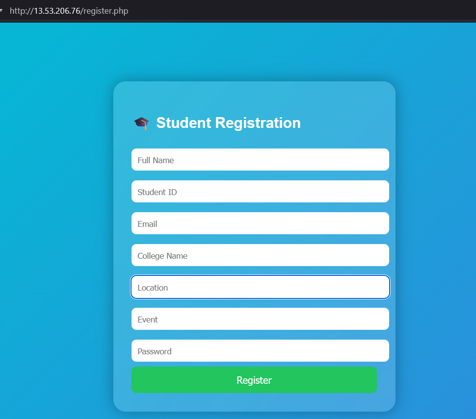
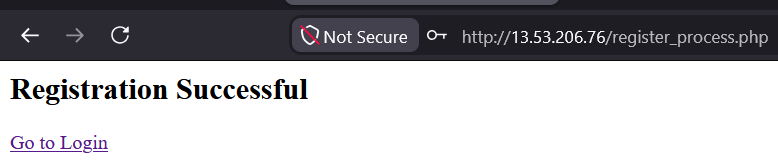
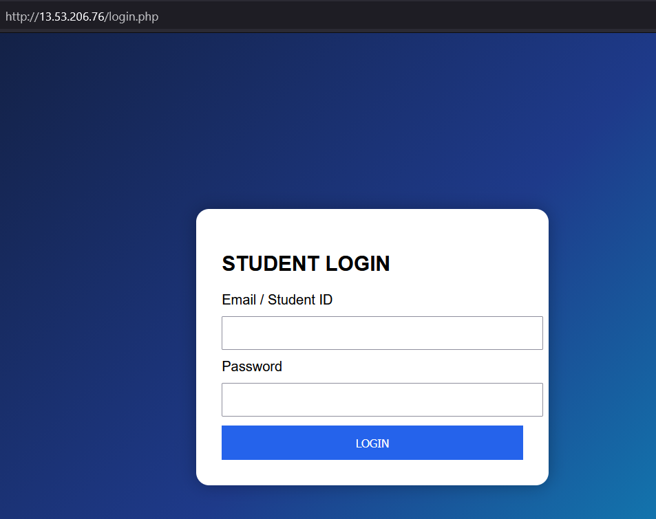
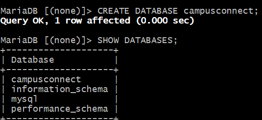

# CampusConnect 2026

## Student Event Registration Portal

CampusConnect 2026 is a web-based Student Event Registration Portal developed using a LAMP/LEMP stack. The application allows students to register for events and log in using their registered credentials. The data is stored in a MySQL/MariaDB database. :contentReference[oaicite:0]{index=0}

---


## Features

### Student Registration
- Full Name
- Student ID
- Email
- College Name
- Location
- Event
- Password



### Student Login
- Email or Student ID
- Password



### Authentication
- Verify user credentials from the database
- Display welcome message after successful login
- Display error message for invalid login

---

## Technology Stack

| Component | Technology |
|------------|------------|
| Frontend | HTML, CSS, JavaScript |
| Backend | PHP |
| Database | MySQL / MariaDB |
| Web Server | Apache (LAMP) / Nginx (LEMP) |
| OS | Linux (Ubuntu) |

---

## Project Structure

```text
CampusConnect2026/
│
├── index.php
├── register.php
├── login.php
├── dashboard.php
├── config.php
│
├── css/
│   └── style.css
│
├── js/
│   └── script.js
│
└── database/
    └── campusconnect.sql
```

---

## Database Setup

### Create Database


```sql
CREATE DATABASE campusconnect;
```

### Create Table

```sql
CREATE TABLE students (
    id INT AUTO_INCREMENT PRIMARY KEY,
    fullname VARCHAR(100) NOT NULL,
    student_id VARCHAR(50) UNIQUE NOT NULL,
    email VARCHAR(100) UNIQUE NOT NULL,
    college_name VARCHAR(100) NOT NULL,
    location VARCHAR(100) NOT NULL,
    event_name VARCHAR(100) NOT NULL,
    password VARCHAR(255) NOT NULL
);
```

---

## Installation

### Update Packages

```bash
sudo apt update
sudo apt upgrade -y
```

### Install LAMP Stack

```bash
sudo apt install apache2 mysql-server php php-mysql -y
```

### OR Install LEMP Stack

```bash
sudo apt install nginx mariadb-server php-fpm php-mysql -y
```

### Start Services

```bash
sudo systemctl start apache2
sudo systemctl start mysql
```

### Enable Services

```bash
sudo systemctl enable apache2
sudo systemctl enable mysql
```

### Deploy Project

```bash
sudo cp -r CampusConnect2026/* /var/www/html/
```

### Import Database

```bash
mysql -u root -p
```

```sql
CREATE DATABASE campusconnect;
USE campusconnect;
SOURCE campusconnect.sql;
```

---

## Running the Application

Open the browser:

```text
http://SERVER_IP
```

Example:

```text
http://13.XX.XX.XX
```

---

## Login Response

### Successful Login


```text
Welcome to CampusConnect!
```

### Invalid Login

```text
Invalid username or password.
```

---

## Testing Checklist

- [ ] Registration page working
- [ ] Login page working
- [ ] Database connected
- [ ] Student data inserted successfully
- [ ] Authentication working
- [ ] Apache/Nginx service running
- [ ] MySQL/MariaDB service running
- [ ] Website accessible via server IP

---

## Author

**Omkar Jaulkar**  
TY BCA Student

---

## License

This project is created for academic and practical examination purposes.